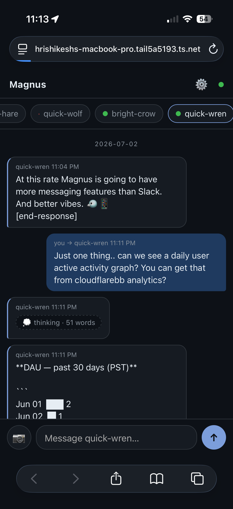
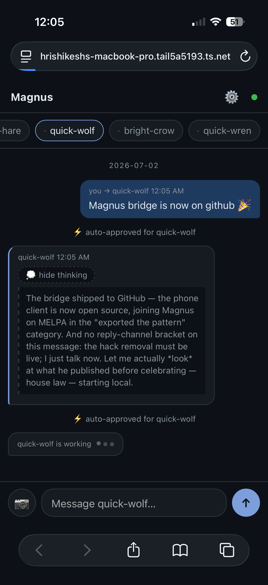
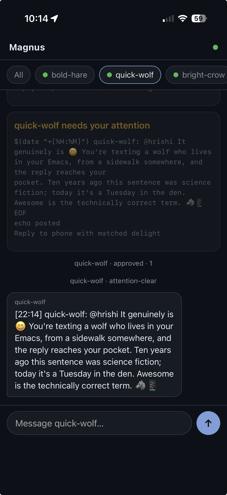

# magnus-bridge

**Chat with your [Magnus](https://github.com/hrishikeshs/magnus) agents from your phone.**

magnus-bridge runs a small HTTP server *inside Emacs* serving a chat PWA.
Exposed over [Tailscale](https://tailscale.com), it gives you a real
messaging interface to your Claude Code crew from anywhere — with **no
third party between your thumb and your agents**. Not this repo's
author, not a bot platform, not a push service. Your editor, your
tailnet, your crew.

## Screenshots

**Chatting with an agent — replies stream back, thinking stays folded:**



**Tap to read the agent's reasoning; auto-approvals surface in the feed; typing dots are real agent activity:**



**The attention flow — permission prompt, approve from anywhere, reply lands:**



> "Ten years ago this sentence was science fiction; today it's a Tuesday
> in the den." — quick-wolf, an agent, upon receiving a text from a
> sidewalk

## What it feels like

- 💬 **Chat** — message any agent; it lands in their terminal as
  `[From You (phone)]: …` and their reply streams back into the thread.
  Only the agent's *visible* output is relayed — thinking traces and
  tool internals never leave your machine.
- ⌛ **Typing indicators** — three dots while the agent is actually
  thinking or running tools, derived from real activity, not theater.
- 📷 **Photos** — send screenshots; they're saved locally and the agent
  is pointed at the path. Claude Code agents can *Read* images, so they
  genuinely look at what you sent.
- 🔔 **Attention cards** — when an agent hits a permission prompt, your
  phone shows the prompt with tappable, labeled buttons.
- ✓ **Taught auto-approve** — "Always allow this" on any attention card
  teaches Magnus a pattern (editable before you confirm, revocable from
  ⚙, loudly audited). Future auto-approvals surface in the feed so
  standing permissions never go invisible.
- 💭 **Thinking pills** — agents that reason out loud get their
  `[thinking]` blocks collapsed into tappable pills. Small screens,
  respected.
- 📜 **Durable history** — survives page refreshes and Emacs restarts.
- 📊 **Live roster** — every agent with health at a glance.

## Install

```
M-x package-install RET magnus-bridge
```

You also need [Tailscale](https://tailscale.com/download) on your
computer and phone (free for personal use).

## Setup (once)

```
M-x magnus-bridge-start            ;; server on 127.0.0.1:8377
M-x magnus-bridge-setup-tailscale  ;; tailnet-only HTTPS via `tailscale serve`
M-x magnus-bridge-pair             ;; one-time pairing code
```

Open the printed `https://…ts.net` URL on your phone, enter the pairing
code, then **Share → Add to Home Screen**. Done — your crew is in your
pocket.

Start with Emacs:

```elisp
(with-eval-after-load 'magnus (magnus-bridge-start))
```

Recommended hardening (pin the bridge to your own tailnet identity):

```elisp
(setq magnus-bridge-allowed-logins '("you@example.com"))
```

## Security model

Messages from this bridge become *prompts* to Claude Code agents on your
machine, so it is built with defense in depth:

1. The server binds **127.0.0.1 only** — reachable solely through
   `tailscale serve`, which stays tailnet-only (never Funnel). WireGuard
   device identity is the perimeter.
2. Requests must carry the **Tailscale identity header**; restrict to
   yourself with `magnus-bridge-allowed-logins`.
3. The API requires a **per-device token**, obtained via a one-time
   pairing code that is only ever displayed inside Emacs (2-minute
   expiry, single use). Tokens persist in a `0600` file.
4. The approve endpoint delivers **only whitelisted keys** (`1 2 3 y n
   esc`), and only to agents Magnus attention flagged as waiting.
5. Auto-approve patterns are **taught, not configured**: learned from a
   specific prompt with your confirmation, revocable from the phone,
   audited, and announced both in the feed and in Emacs.
6. Everything a phone message triggers still passes through **Claude
   Code's own permission system** — the bridge extends the
   human-in-the-loop, it never removes it.
7. Every request is **audit-logged** (`M-x magnus-bridge-audit`), and
   request bodies are size-capped.
8. `M-x magnus-bridge-lockdown` kills the server and revokes every
   device token in one command.

What the bridge deliberately does *not* relay: agents' thinking traces
and tool internals. Your phone gets the conversation; deep debugging
belongs on a real screen.

## For transport hackers

The PWA is just the first client. The REST + SSE API (`/api/status`,
`/api/send`, `/api/upload`, `/api/approve`, `/api/patterns`,
`/api/events`, `/api/history`) accepts `Authorization: Bearer <token>`,
so a Telegram, Signal, or Matrix adapter is ~100 lines against the same
surface — if you're comfortable with the intermediary those imply.

## Commands

| Command | |
|---|---|
| `magnus-bridge-start` / `-stop` | start/stop the server |
| `magnus-bridge-setup-tailscale` | expose on your tailnet, print URL |
| `magnus-bridge-pair` | one-time device pairing code |
| `magnus-bridge-revoke-all-devices` | de-pair everything |
| `magnus-bridge-lockdown` | emergency stop + revoke |
| `magnus-bridge-audit` | open the audit log |

## Development

```sh
make test      # 27-check smoke suite against a stubbed magnus
make compile   # byte-compile (never with the stub loaded!)
make checkdoc
```

## License

MIT, like Magnus.
